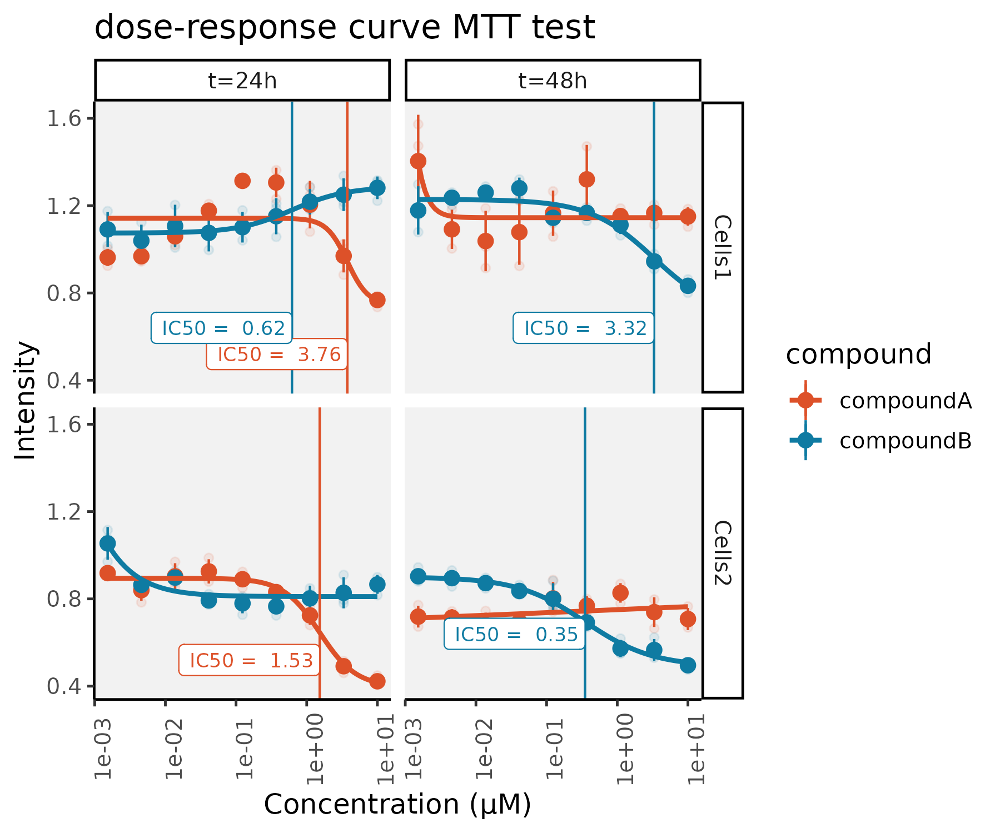

# doseResponseCurveinR
tutorial on how to get a dose response curve in R and read data from 96-well format

data for dose-resonse curves is often collected from 96 well plates and analysed by copy-pasting from excel to excel to prism... There is a lot of room for error there!
Importing them directly from excel files into R, especially with a lot of files, might be very useful in that case. 

Here's how!

