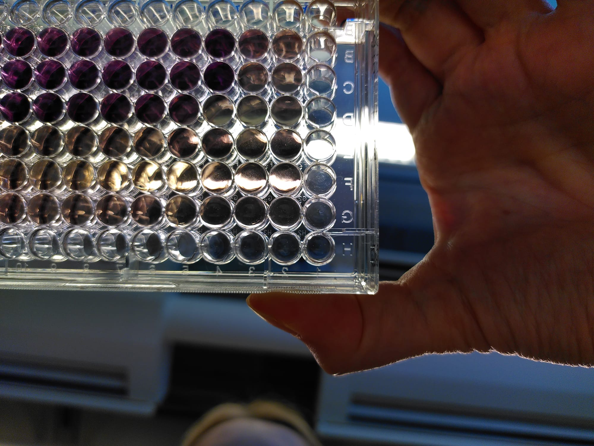

Dorien Pastoors `r format(Sys.time(), '%d %B, %Y')`


# Aim

With this script you can import data from plate reader files (in 96 wells), and convert them to long format, do some quality checks on the data, normalise and finally use ggplot and drc to plot curves and calculate the ic50.
The final result will be like this:

{width=50%}


The dummy data in this experiment is a time series titration with 2 compounds, two time points, and two cell types. This run of this particular experiment did not work so well this time around which is why I'm using it here (see Note on the Data for details). 

All files you need to do this are here:
[github repository link](https://github.com/dorienpastoors/doseResponseCurveinR)

## Background 
MTT is a glucose metabolism assay that can contain outliers quite easily. It's a metabolic assay with a colorimetric read-out after addition of acidic isopropanol. 

<left>
{width=30%}
</left>


In this picture you can see some of the wells are purple (= very alive/metabolically active) and some are yellow-ish (dead/not metabolically active). In the plate reader, this results in a high read-out for purple and low for yellow. (It measures absorbance at 560nm).

Each well is set up and analysed in triplicate. In this particular assay, due to having to dissolve crystals with a multichannel pipette, it is quite likely there will be some wells with very odd, outlier values, which need to be left out of the analysis. So, an important step here is to identify and filter those observations which have a very high SD, before doing the actual analysis.

So, lets get to it!


# Packages

```{r, echo = FALSE, message = FALSE, warning = FALSE}
library(tidyverse)

library(readxl)

library(ggpubr)

library(drc)

library(MetBrewer)

library(knitr)
```


## citation
```{r}
citation("drc")

```


# Data import

Data for this experiment is collected in 96 well plates. In the file plateLayout.xlsx this is stored. 
Each plate is the same in layout, but the difference between different files is the compound, and the timepoint. 
We will first make a design table with the files to be imported for this analysis.


## Design table 

I'm using regular expressions to extract the information about the compound and timepoint. This is the pattern argument in the str_extract function. Regular expressions allow you to search for literal matches against a pattern (i.e. find "compound" in a string), but what is most useful about them is they allows for partial matching, or searching for information right after a word (which is what I've used here). Especially if your names are not all the same length this is very helpful.
The first pattern extracts from the file name compound + the character after compound (this is called a wildcard, the full stop .)
The second pattern for timepoint extracts t=, followed by two digits (\\d) and h. If your files are more inconsistently named such as with multiple _, " " or ; , you can also make a regular expression that is more flexible than the two used here (you can also say things like: match "compound[any number of whitespace]."


```{r}
design_table <- data.frame(fileName = list.files("files/"), filePath = file.path("files", list.files("files/")))

design_table <- design_table %>%
  mutate(compound = str_extract(fileName, pattern = "compound."), 
  timepoint = str_extract(fileName, pattern = "t=\\d\\dh"))


knitr::kable(design_table)
```


## Importing the first data file

Our import function needs two bits of information to go in: the plate layout (from plateLayout.xlsx, the sheet plateLayout), and the data which we are looking for. This layout corresponds to the data in the data tables, sheet Plate_Page1, rows 7-14, columns A-L. We will use read_excel for this which allows to specify a range to import.

In the end, we want to have a table with as columns cellType, compound, timepoint, concentration, value. I will first show how to import 1 single file in this way, and then how to extend this to multiple files based on the design table.
This helps us to know how to exactly write this data import function.
```{r}

plate1  <- read_excel(design_table$filePath[1], range = "A7:L14", sheet = "Plate_Page1", col_names = FALSE)

#we will rename them like the plate layout colnames and rownames
colnames(plate1) <- c(1:12)
plate1$rowNames <- LETTERS[1:8]

knitr::kable(plate1)

```

So, this was pretty easy to read into R. We now want to melt it to get to a format where each row is only 1 observation. To identify each observation, we want to have the well ID (A1, A2, A3 etc. ) as another column.

```{r}
plate1_long <- plate1 %>% 
  pivot_longer(cols = paste0(c(1:12)))%>%
  mutate(wellID = paste0(rowNames, name)) %>%
  dplyr::select(wellID, value)

knitr::kable(head(plate1_long))

```

Done! Now we need to involve the plate layout and do the same with the plate layout.

## Importing the plate layout

If you've done these type of experiments you've probably made plate layouts before in excel. The one you will be needing here is pretty much the same, except every cell needs to contain the information what its contents are, so no merging of replicates. This is easy to make if you split all the information from your layout to two different tables, where each table has only 1 type of information (the concentration, or the cell type). You can then merge them to get this information for each well / cell. An example is in the plateLayout.xlsx file, where in makePlateLayout you can see how to combine them.


```{r}
plateLayout <- read_excel("plateLayout.xlsx", sheet = "PlateLayout", range = "A1:M9")

plateLayout_long <- plateLayout %>% 
  pivot_longer(cols = paste0(c(1:12)))%>%
  mutate(wellID = paste0(rowNames, name)) %>%
  dplyr::select(wellID, value) %>%
  filter(!is.na(value))

knitr::kable(head(plateLayout_long))

```

The information in the value column here still needs to be splitted a bit more to separate columns. Here I'm splitting value into CellType and Concentration, removing the column number information, and converting Concentration to a numeric variable. 

```{r}
plateLayout_long <- plateLayout_long %>%
  separate(value, sep = ";", into = c( "cellType", "concentration_uM"))%>%
  mutate(cellType = gsub("CellType:", "", cellType), 
         concentration_uM = as.numeric(gsub("Concentration_uM:", "", concentration_uM)))

knitr::kable(head(plateLayout_long))
```

The last step in our function should be to merge the plateLayout with the plate data. We can do this using wellID, and we only need to keep the wellIds present in the plate layout. We will then use the design table first row to add the sample information from these observations!

```{r, warning=FALSE}

plate1_data <- merge(plateLayout_long, plate1_long, by = "wellID", all.x = TRUE)

plate1_data <- cbind(plate1_data, design_table[1,])

knitr::kable(head(plate1_data))

```


## Write function for data import

We're now going to use the code above to write a function. You will see the code is almost the same, except it does not directly use variables we've defined before, but it uses the arguments of the function. 
For now, we have 1 plate layout for all plates. If you have an experiment where this is not the case, you can add a new column in the design table specifying where each corresponding plate layout is located and read a separate plate layout per file. However, it is of course always much easier if they're all the same (also for doing your experiment).

The design table needs to contain a column called filePath which points to the excel file. 

I'm using two functions using the guideline that one single function should be to perform 1 task. So 1 function is for importing the data files as single dataframes, and the wrapper function (or the final function), uses this singlePlateImport to import all plates form the design table. 

Having this single import as a separate function allows you to customize your script better to new situations, as you will have to make each change only once. 


```{r, warning = FALSE, message = FALSE}
importSinglePlateFile <- function(plateLayout_long, design_table, i){
  
  # suppressmessages is because ReadXL otherwise has a message for each column that is not named
  plate1  <- suppressMessages(read_excel(design_table$filePath[i], range = "A7:L14", sheet = "Plate_Page1", col_names = FALSE))
  colnames(plate1) <- c(1:12)
  plate1$rowNames <- LETTERS[1:8]
  
  plate1_long <- plate1 %>% 
    pivot_longer(cols = paste0(c(1:12)))%>%
    mutate(wellID = paste0(rowNames, name)) %>%
    dplyr::select(wellID, value)
  
  plateData <- merge(plateLayout_long, plate1_long, by = "wellID", all.x = TRUE)
  
  plateData <- cbind(plateData, design_table[i,])
  
}

# test function 
 tempplate <- importSinglePlateFile(plateLayout_long, design_table, 1) 

importPlateReaderData <- function(path_to_plateLayout, design_table){
  
  # import plate layout
  
  plateLayout <- read_excel(path_to_plateLayout, sheet = "PlateLayout", range = "A1:M9")
  
  plateLayout_long <- plateLayout %>% 
    pivot_longer(cols = paste0(c(1:12)))%>%
    mutate(wellID = paste0(rowNames, name)) %>%
    dplyr::select(wellID, value) %>%
    filter(!is.na(value)) %>%
    separate(value, sep = ";", into = c( "cellType", "concentration_uM"))%>%
    mutate(cellType = gsub("CellType:", "", cellType), 
           concentration_uM = as.numeric(gsub("Concentration_uM:", "", concentration_uM)))
  
  # printing helps to see if what is happening is what you want to happen
  print(head(plateLayout_long))
  
  # read the first plate
  
  plateData <- importSinglePlateFile(plateLayout_long = plateLayout_long, 
                                     design_table = design_table , 
                                     i = 1)
  
  print("first import completed!")
  # continue to the other plates
  
  for(i in 2:nrow(design_table)){
    
    newPlateData <- importSinglePlateFile(plateLayout_long = plateLayout_long, 
                                     design_table = design_table , 
                                     i = i)
    
    plateData <- rbind(plateData, newPlateData)
    
    
    print(paste0(i, " th row completed "))
  }
  

  return(plateData)
}
```


```{r, warning = FALSE, message = FALSE}
plateReaderData <- importPlateReaderData(path_to_plateLayout = "plateLayout.xlsx", design_table = design_table)
```

So, that's the first step taken: all data imported. This is of course only very few files but you can easily extend this to as many files as you want to import. 

This data is collected in replicates. 
I will first convert a few identifying columns into factors (the levels argument specifies the order of the factor, which determines the plotting order used later)
We will first identify which wells are replicates by grouping data by celltype, replicate, timepoint and concentration.

```{r}
plateReaderData$cellType <- factor(plateReaderData$cellType, levels = c("Cells1", "Cells2", "noCells"))

plateReaderData$compound <- factor(plateReaderData$compound, levels = c("compoundA", "compoundB"))

plateReaderData$timepoint <- factor(plateReaderData$timepoint, levels = c("t=24h", "t=48h"))


plateReaderData <- plateReaderData %>%
  dplyr::select(cellType, timepoint, compound,concentration_uM, value, fileName, filePath) %>%
  group_by(cellType, compound, timepoint, concentration_uM) %>%
  mutate(replicateID = paste0("rep_", 1:n())) %>%
  mutate(median = median(value), sd = sd(value)) %>%
  ungroup() %>%
  mutate(dev_obs  = abs(value - median)>sd)
```


# Filtering outliers

The standard deviation shows for most replicates, this is below 15% of the median. Since this assay sometimes records very high SDs, we will take a closer look at those. 
```{r}
hist(plateReaderData$sd/plateReaderData$median)
```

Within each replicate group, I've now calculated the median and SD. Since there are 3 replicates, the median is always the middle observation. This means that if there is an outlier (which we know based on the SD being very large), 1 observation is equal to the median, 1 observation is close, and the other one is very far from the median. This means that if X is an observation within a group, for the measurement that is furthest away from the other two, X-median > SD. 
When filtering on both having a high SD , and whether this observation is furthest form the mean, you can exclude outlier values.

This is of course depending on the type of assay whether this is suitable.


```{r}
plateData_high_var <- plateReaderData %>%
  filter( sd/median > 0.15)
```


```{r, fig.height=3, fig.width=10}
ggplot(data = plateData_high_var, 
       aes(x = replicateID, y =paste0(timepoint, concentration_uM,compound,cellType), 
           fill = value, label = round(value,2)))+
  geom_tile()+
  scale_fill_viridis_c()+
  geom_tile(data = plateData_high_var%>%filter(dev_obs), color = "red", size = 1)+
  geom_text()+
  theme_classic2()+
  ggtitle("observations in red boxes are filtered out", subtitle = "sd of group > 15% of median & abs(median-observation)>sd")

ggsave(filename =  "filtering_heatmap.png")
```

## Exclude outliers based on the criteria above

```{r}
plateReaderData_filtered <- plateReaderData %>% filter(!(dev_obs & sd/median>0.15))

```


# Normalise and background-subtract

For MTT data, you generally present your data as % of untreated. The 0% here is background, so media without cells. The background is collected per plate, while the maximum is is per plate, per cell type.
Here, I'm generating a normalization data frame with all those controls which I will then merge into the original data frame.

```{r}

plateReaderData_mediaOnly <- plateReaderData_filtered %>%
  filter(concentration_uM == 0 & cellType == "noCells") %>%
  group_by(fileName) %>%
  summarise(mean_media = mean(value))

plateReaderData_untreated <- plateReaderData_filtered %>%
  filter(concentration_uM == 0 & cellType != "noCells") %>%
  group_by(fileName, cellType) %>%
  summarise(mean_untreated = mean(value))

plateReader_normFactors <- merge(plateReaderData_mediaOnly, plateReaderData_untreated, by = "fileName")

plateReader_normFactors <- plateReader_normFactors %>%
  mutate(mean_untreated_backgroundSubtr = mean_untreated - mean_media)

knitr::kable(plateReader_normFactors)

```

I will now merge this with the data, and omit the noCells wells.
Because there is no noCells in the normFactors data frame, these rows are dropped here as well.

```{r}
plateReaderData_filtered <- merge(plateReaderData_filtered, plateReader_normFactors, by = c("fileName", "cellType"))

plateReaderData_filtered$cellType <- droplevels(plateReaderData_filtered$cellType)
```

Now we need to subtract background and normalize all values to untreated. 

```{r}
plateReaderData_filtered <- plateReaderData_filtered %>%
  mutate(value_bckgr_correct = value - mean_media ) %>%
  mutate(value_norm = value_bckgr_correct / mean_untreated_backgroundSubtr)
```


# Heatmaps

For heat maps, per group, I'm first calculated the mean, and then normalizing versus the maximum value per celltype, compound and treatment group. In actual experiments, I also often have a background to subtract but I haven't got that here.


```{r filter mtt}
# these are filtered out

plateReaderData_filtered_summary <- plateReaderData_filtered %>% 
  group_by(cellType, compound, timepoint, concentration_uM) %>%
  summarise(mean = mean(value_norm)) %>%
  ungroup() 

```

So, this has summarized our experiment. Let's quickly look at a heat map to get a first overview of the treatment!

```{r heatmaps mtt1, fig.height=4, fig.width=4}

# this converts the concentration to a factor, which makes it easier to invert the axis

plateReaderData_filtered_summary$concentration_uM_f <- factor(round(plateReaderData_filtered_summary$concentration_uM, 3), 
                                                              levels = rev(levels(factor(round(plateReaderData_filtered_summary$concentration_uM,3)))))

ggplot(data = plateReaderData_filtered_summary, aes(x = cellType, y = concentration_uM_f, fill = mean))+
         geom_tile()+
  scale_fill_viridis_c(limits = c(0,1.15), direction = -1)+
  facet_grid(compound~timepoint)+
  scale_y_discrete()+
  theme_classic2()+
  ggtitle("Heatmap", subtitle = "outliers removed | mean of 2-3 wells")


ggsave(filename =  "heatmap.png")

```
From this it seems apparent Cells1 are sensitive to compoundA, while cells2 are sensitive to compoundB!
But what about the IC50?

# Calculate IC50

We're now going to use the drc (dose-response curve) package.

To do this, I've written a for-loop that writes data back into the IC50 data frame. You could make this into a function by wrapping it in a function() of course.
```{r curve fit dose response, message = FALSE, warnings = FALSE, echo = FALSE}
result_IC50 <- data.frame(treatment = c(), timepoint = c(), cellType = c(), IC50 = c(), error = c())


for(i_timepoint in levels(plateReaderData_filtered$timepoint)){
  #print(i_timepoint)
  
  for(j_compound in levels(plateReaderData_filtered$compound)){
    
    #print(j_compound)
    
    for(k_cellType in levels(plateReaderData_filtered$cellType)){ 
      
      plateReaderData_temp <- plateReaderData_filtered %>% 
        filter(timepoint == i_timepoint & compound == j_compound & concentration_uM > 0 &cellType == k_cellType)%>%
        mutate(y = value_norm, x = log10(concentration_uM))%>%
        dplyr::select(x, y)
      #print(plateReaderData_temp)
      
      drm_fit <- suppressMessages(drm( y ~x , fct = L.4(), data = plateReaderData_temp))
      
      temp_result <- data.frame(compound = j_compound, timepoint = i_timepoint, cellType = k_cellType,
                                IC50 = ED(drm_fit, 50)[[1]], error = ED(drm_fit, 50)[[2]])
      
      #print(temp_result)
      
      result_IC50 <- rbind(result_IC50, temp_result)
      
    }
    
    
  }
  
}
```

```{r}
knitr::kable(result_IC50)
```


I'm now changing the factors of the IC50 result to match the data in the plateReader results data frame, because I want to plot them together. I'm also removing the IC50 that have a high error because I don't want to use those.

```{r result dose response}
result_IC50$compound <- factor(result_IC50$compound, levels = levels(plateReaderData_filtered$compound))

result_IC50$timepoint <- factor(result_IC50$timepoint, levels = levels(plateReaderData_filtered$timepoint))

result_IC50$cellType <- factor(result_IC50$cellType, levels = levels(plateReaderData_filtered$cellType))

result_IC50_f <- result_IC50%>%filter(error < 1 & !is.na(error))


result_IC50_f$IC50_power <- 10^result_IC50_f$IC50
```


```{r}
knitr::kable(result_IC50_f)
```
That's it!

Let's get to the final plot. I've made two versions: one with geom_point() only, and one with stat_summary which can omit the actual data points.


# IC50 Dose-response plot

```{r, fig.height=5, fig.width=6}
ggplot(data = plateReaderData_filtered%>%filter(concentration_uM>0), aes(x = concentration_uM, y = value_norm*100, color = compound))+
  
  # data
  geom_point()+
  geom_smooth(method=drm, method.args = list(fct = L.4()),se=FALSE)+
  
  # scales and wrap
  scale_x_log10()+
  facet_grid( cellType ~ timepoint)+
  xlab("Concentration (µM)")+
  ylab("% of untreated")+
  
  # text with ic50 value
  
  geom_vline(data = result_IC50_f, aes(xintercept = IC50_power, color = compound))+
  geom_label(data = result_IC50_f, aes(x = IC50_power, y = 40+as.numeric(compound)*12, label = paste("IC50 = ", round(IC50_power,2)), 
                                      color = compound), hjust = 1, size = 3, show.legend = FALSE)+
  
  # theme 
  theme_classic2()+
  
  theme(panel.background = element_rect(fill = "grey95"))+
  scale_color_manual(values = met.brewer("Egypt", n = 2) )+
  theme(axis.text.x = element_text(angle = 90))+
  ggtitle("dose-response curve MTT test")
  
  
ggsave( "dose_response_mtt.png")

```

## only mean and SD


based on this question on [stackoverflow](https://stackoverflow.com/questions/21239418/use-stat-summary-in-ggplot2-to-calculate-the-mean-and-sd-then-connect-mean-poin)


```{r, fig.height=5, fig.width=6, warning=FALSE, message=FALSE}
ggplot(data = plateReaderData_filtered%>%filter(concentration_uM>0), aes(x = concentration_uM, y = value_norm*100, color = cellType))+
  
  # data
  geom_point(alpha = 0.1)+
  stat_summary(fun.y = mean, 
               fun.min = function(x) mean(x) - sd(x),
               fun.max = function(x) mean(x) + sd(x))+
  geom_smooth(method=drm, method.args = list(fct = L.4()),se=FALSE)+
  
  # scales and wrap
  scale_x_log10()+
  facet_grid( timepoint ~ compound)+
  xlab("Concentration (µM)")+
  ylab("% of untreated")+
  
  # text with ic50 value
  
  geom_vline(data = result_IC50_f, aes(xintercept = IC50_power, color = cellType))+
  geom_label(data = result_IC50_f, aes(x = IC50_power, y = 40+as.numeric(cellType)*12, label = paste("IC50 = ", round(IC50_power,2)), 
                                      color = cellType), hjust = 1, size = 3, show.legend = FALSE)+
  
  
  # theme 
  theme_classic2()+
  
  theme(panel.background = element_rect(fill = "grey95"))+
  scale_color_manual(values = met.brewer("Egypt", n = 2) )+
  ggtitle("dose-response curve MTT test")
  
  
ggsave( "dose_response_mtt_no_ind_points.png")

```

# Note on data

As said in the beginning, the data used in this tutorial is based on an experiment that kind of failed. I used some curves from this failed experiment that still looked good to simulate data that you've used here using the DRC package. In addition, the background was generated with rnorm(). The data used in this tutorial is therefore simulated MTT data, not real MTT data. The outlier is because for that simulation I increased the error rate.
The code used to make simulations are also on github, in a folder called simulation.
